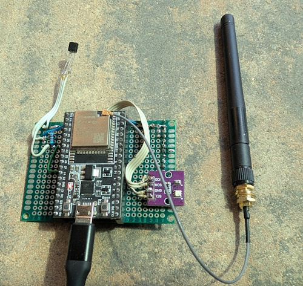
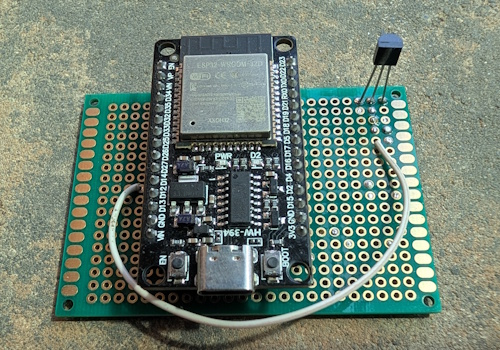
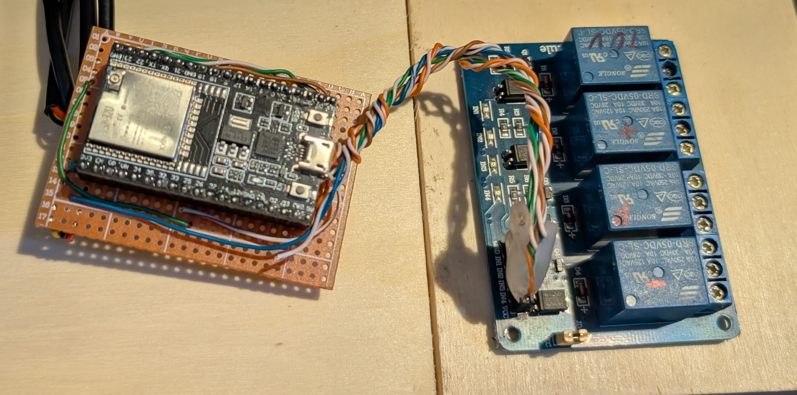
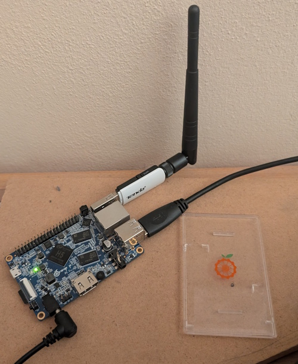
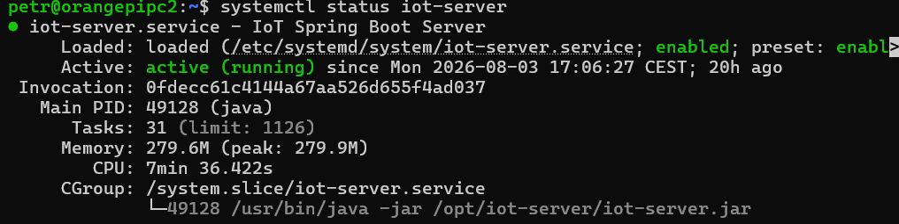
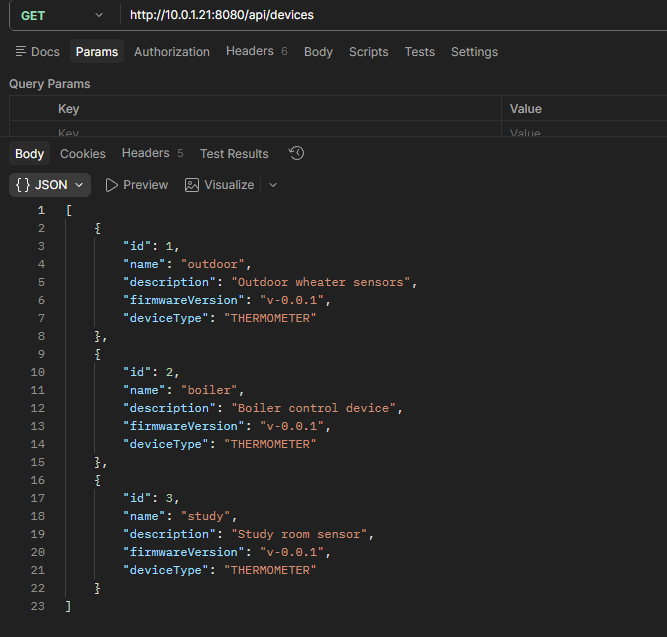
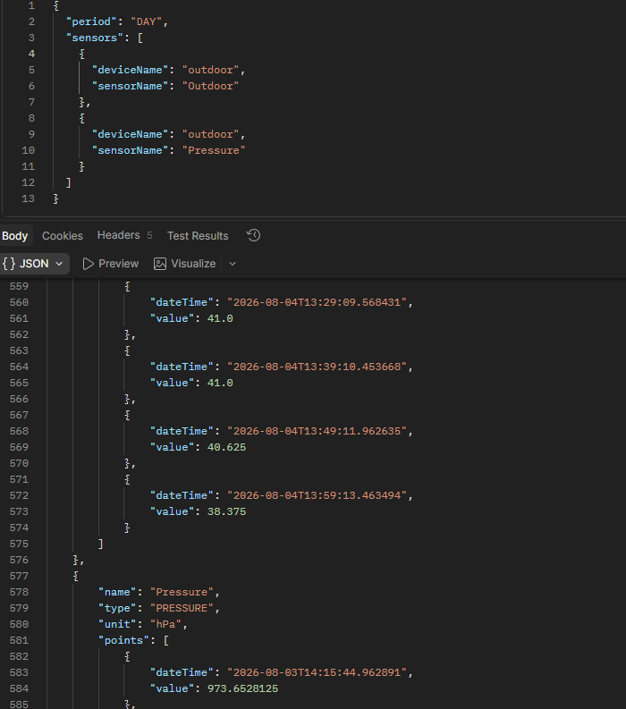

# IoT Devices

IoT Devices is a firmware project for ESP32-based devices communicating with the IoT Server over HTTP.

The project provides reusable components for sensor integration, networking, JSON communication and command execution. It serves as a foundation for environmental monitoring and future IoT applications.

---

## Quick Links

📦 **IoT Devices Repository**

https://github.com/FD-technic/iot-devices

📦 **IoT Server Repository**

https://github.com/FD-technic/iot-server

---

# Hardware

### ESP32 Weather Station



---

### ESP32 Temperature Sensor



---

### ESP32 Heating Controller



---

### IoT Server

The firmware communicates with the Spring Boot backend running on an Orange Pi.



---

# Communication

### Running IoT Server

The backend is deployed as a Linux systemd service.



---

### Registered Devices

The firmware communicates with the backend through REST APIs.



---

### Historical Sensor Data

Collected measurements are available through the backend API.



---

# Features

- ESP32 firmware
- HTTP communication
- JSON messaging
- Modular sensor architecture
- Automatic telemetry reporting
- Device status reporting
- Remote target configuration
- Manual device control
- Automatic heating control
- Heating valve control
- Heating pump control
- Water heater pump control
- PlatformIO support
- Reusable firmware components

---

# Tech Stack

- C++
- PlatformIO
- ESP32
- Arduino Framework
- ArduinoJson
- HTTP Client
- WiFi
- Git
- GitHub

---

# Architecture

```text
Sensors
    │
    ▼
Measurement Layer
    │
    ▼
Measurement Batch
    │
    ▼
JSON Payload
    │
    ▼
HTTP Client
    │
    ▼
IoT Server
    │
    ▼
Server Response
    │
    ├── Targets
    ├── Heating Mode
    └── Device Commands
    │
    ▼
Device Controllers
    │
    ├── Heating Valve
    ├── Heating Pump
    └── Water Heater Pump

```

---

# Supported Hardware

- ESP32
- ESP32-C3
- DS18B20
- BMP280
- AHT20

---

# Project structure

```text
IoT-devices/
│
├── HeatingController/
├── WeatherStation/
├── StudyStation/
│
├── libraries/
│   ├── core/
│   ├── network/
│   └── sensors/
│
├── docs/
│
├── platformio.ini
└── README.md
```
Shared functionality is organized into reusable libraries.
Device-specific code remains inside the corresponding device directory.

# Configuration

Local configuration files containing credentials are not stored in the repository.

The shared network configuration uses:

libraries/network/HeatingConfig.h

This file is ignored by Git.

A configuration template is provided as:

*libraries/network/HeatingConfig.h.example*

Copy the example to *HeatingConfig.h* and configure the local Wi-Fi and server settings before building the firmware.

Do not commit *HeatingConfig.h* or other local configuration files containing credentials.

# Getting Started

## Requirements

- VS Code
- PlatformIO
- ESP32 board package

---

## Configuration

Create the local configuration from the provided template:

```text
HeatingConfig.h.example
        ↓
HeatingConfig.h
```

Configure the required Wi-Fi and server settings.

## Build

```bash
pio run
```

---

## Upload

```bash
pio run --target upload
```

---

# Project Status

## Implemented
- HTTP communication
- JSON serialization
- Sensor abstraction
- Modular architecture
- Automatic telemetry reporting
- Device status reporting
- Server commands
- Target temperature configuration
- Manual control
- Heating modes
- Heating valve control
- Heating pump control
- Water heater pump control

## Planned
- OTA firmware updates
- MQTT support
- Additional sensors
- Further configuration improvements
- Deep sleep optimization

---

# Documentation

- [architecture.md](docs/architecture.md)
- [roadmap.md](docs/roadmap.md)

---

# License

MIT